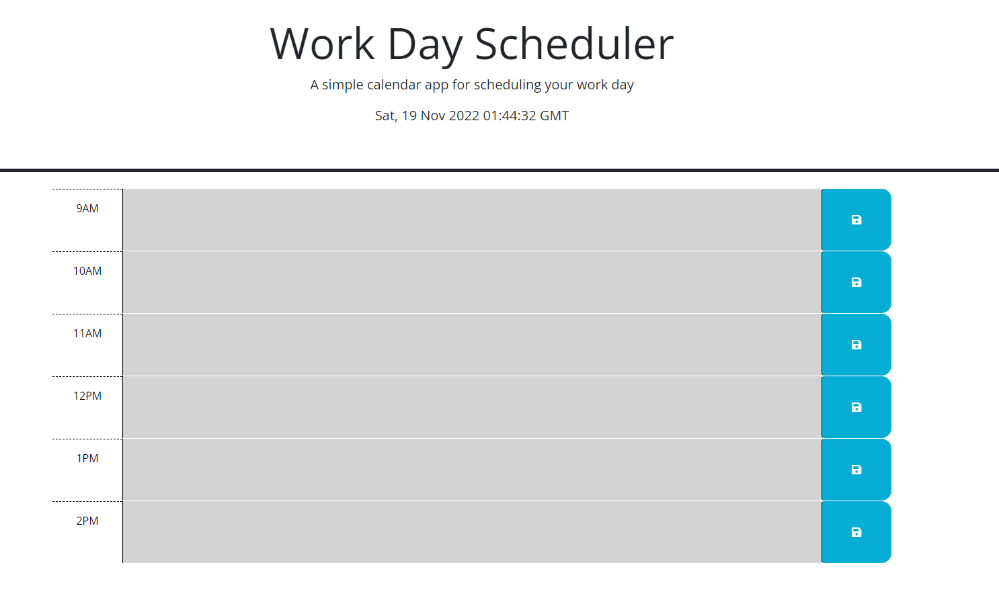
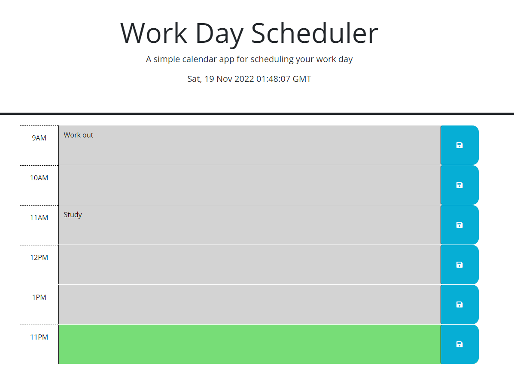

# calendar

Desription:

The current timne is displayed on top of my calendar

When i scroll down, my calendar displays many time blocks which represents its time present by color

When i click into i time block, i can enter and save the event

When i click the save icon, the event is saved on local storage and persist.

URL:

https://github.com/nathannguyen0102/calendar

https://nathannguyen0102.github.io/calendar/

Screenshot:

